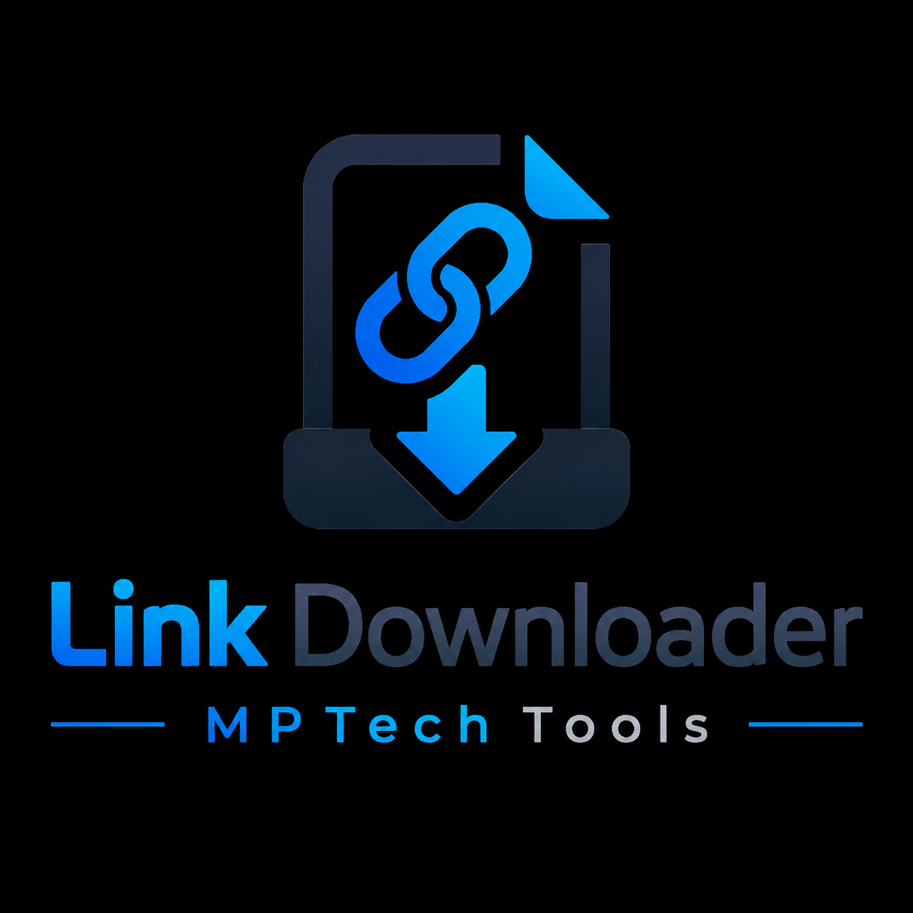
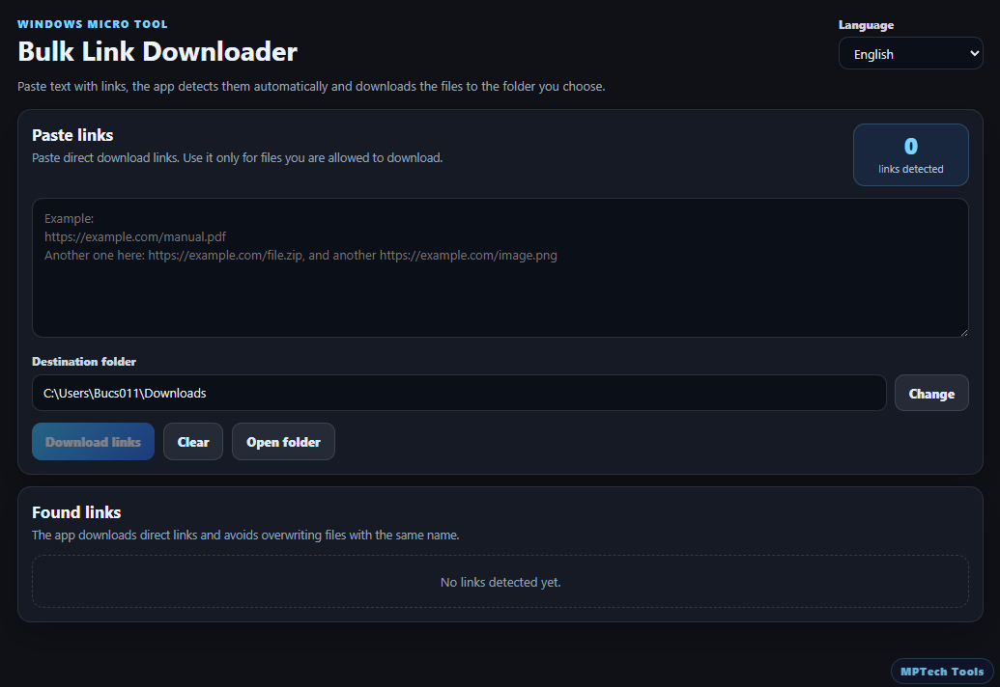

  

# Link Downloader

Link Downloader es una pequeña aplicación portable para Windows que detecta enlaces directos pegados como texto y los descarga automáticamente.

Creado por MPTech Tools.

## Vista previa

## Funciones

- Pegar texto mezclado que contenga enlaces
- Detección automática de enlaces
- Elegir carpeta de destino
- Usa la carpeta Descargas por defecto
- Descarga múltiples archivos
- Evita sobrescribir archivos con nombres repetidos
- Permite abrir la carpeta de destino
- Interfaz en inglés, español y portugués
- EXE portable
- Sin instalador
- Sin cuenta
- Gratis y open source

## Descarga

Ejecutable portable:

../../releases/link-downloader/link-downloader.exe

## Desarrollo

Desde esta carpeta:

tools/link-downloader

Instalar dependencias:

npm install

Ejecutar en modo desarrollo:

npm run tauri dev

## Compilar EXE portable

Ejecutar:

.\build-portable.ps1

El script compila la app y copia el ejecutable final a:

portable/link-downloader.exe

y también a:

../../releases/link-downloader/link-downloader.exe

## Uso responsable

Usa esta herramienta solo para archivos que tengas derecho a descargar.

Esta app no salta DRM, inicios de sesión, paywalls, controles de acceso privados ni restricciones de copyright.
